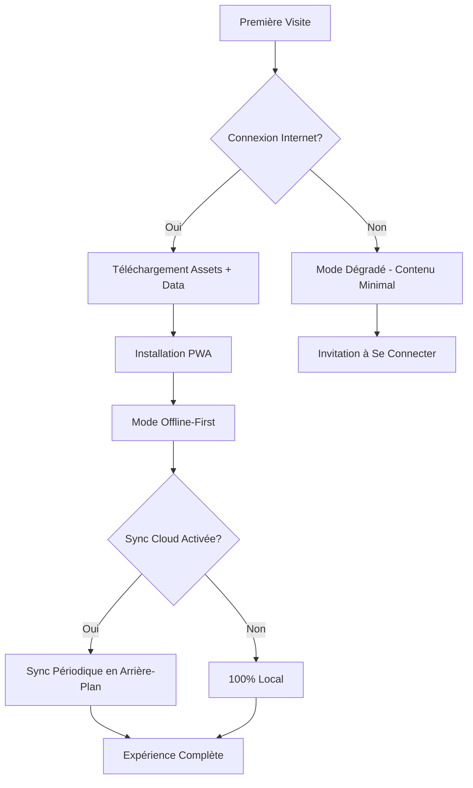

# 🏗️ Architecture Complète - Love Quest

## Document de Référence Architecturale
**Version:** 1.0
**Date:** 2026-09-05
**Type de Projet:** PWA (Progressive Web App) avec Backend Léger
**Objectif:** Cadeau romantique interactif et gamifié

---

## Table des Matières

1. [Vue d'Ensemble de l'Architecture](#1-vue-densemble-de-larchitecture)
2. [Architecture Technique Détaillée](#2-architecture-technique-détaillée)
3. [Architecture Frontend (PWA)](#3-architecture-frontend-pwa)
4. [Architecture Backend Léger](#4-architecture-backend-léger)
5. [Modèle de Données Complet](#5-modèle-de-données-complet)
6. [Architecture des Composants](#6-architecture-des-composants)
7. [State Management & Persistance](#7-state-management--persistance)
8. [Sécurité & Confidentialité](#8-sécurité--confidentialité)
9. [Performance & Optimisation](#9-performance--optimisation)
10. [Déploiement & Infrastructure](#10-déploiement--infrastructure)
11. [Tests & Qualité](#11-tests--qualité)
12. [Évolution & Maintenance](#12-évolution--maintenance)
13. [Guide de Personnalisation](#13-guide-de-personnalisation)

---

## 1. Vue d'Ensemble de l'Architecture

### 1.1 Principes Architecturaux Fondamentaux

**Architecture Hybride Progressive**
```
┌─────────────────────────────────────────────────────────────┐
│                    UTILISATEUR FINAL                         │
│                  (Partenaire Destinataire)                   │
└────────────────────────┬────────────────────────────────────┘
                         │
                         ▼
┌─────────────────────────────────────────────────────────────┐
│                   PWA - FRONTEND LAYER                       │
│  ┌──────────────┐  ┌──────────────┐  ┌──────────────┐     │
│  │   UI Layer   │  │ State Layer  │  │ Service Layer│     │
│  │  (React/Vue) │  │   (Zustand)  │  │  (Workers)   │     │
│  └──────────────┘  └──────────────┘  └──────────────┘     │
│                                                              │
│  ┌──────────────────────────────────────────────────────┐  │
│  │         LOCAL STORAGE (IndexedDB + LocalStorage)     │  │
│  └──────────────────────────────────────────────────────┘  │
└────────────────────────┬────────────────────────────────────┘
                         │
                         │ HTTPS/REST API
                         │ (Optionnel - Sync Cloud)
                         ▼
┌─────────────────────────────────────────────────────────────┐
│                  BACKEND LÉGER (Optionnel)                   │
│  ┌──────────────┐  ┌──────────────┐  ┌──────────────┐     │
│  │  Auth Layer  │  │  API Layer   │  │ Storage Layer│     │
│  │  (Firebase)  │  │  (Express)   │  │  (Firebase)  │     │
│  └──────────────┘  └──────────────┘  └──────────────┘     │
└─────────────────────────────────────────────────────────────┘
```

### 1.2 Décisions Architecturales Clés

| Décision | Choix | Justification |
|----------|-------|---------------|
| **Type d'Application** | PWA (Progressive Web App) | Installation facile, pas de stores, fonctionne offline, multi-plateforme |
| **Framework Frontend** | React 18+ avec TypeScript | Écosystème mature, excellent pour les animations, typage fort |
| **State Management** | Zustand + React Query | Léger, performant, facile à déboguer |
| **Styling** | Tailwind CSS + Framer Motion | Rapidité de développement, animations fluides |
| **Backend** | Firebase (Auth + Firestore) | Gratuit pour usage personnel, setup minimal, temps réel |
| **Hébergement** | Vercel ou Netlify | Déploiement automatique, CDN global, HTTPS gratuit |
| **Offline Strategy** | Service Worker + IndexedDB | Expérience complète offline, sync en arrière-plan |

### 1.3 Modes de Fonctionnement



---

## 2. Architecture Technique Détaillée

### 2.1 Stack Technologique Recommandée

#### Frontend Core
```json
{
  "framework": "React 18.3+",
  "language": "TypeScript 5.0+",
  "buildTool": "Vite 5.0+",
  "packageManager": "pnpm",
  "nodeVersion": "20 LTS"
}
```

#### Librairies Essentielles
```typescript
// package.json (extrait)
{
  "dependencies": {
    // Core
    "react": "^18.3.0",
    "react-dom": "^18.3.0",
    "typescript": "^5.0.0",
    
    // Routing
    "react-router-dom": "^6.20.0",
    
    // State Management
    "zustand": "^4.4.0",
    "@tanstack/react-query": "^5.0.0",
    
    // Styling & Animations
    "tailwindcss": "^3.4.0",
    "framer-motion": "^11.0.0",
    "clsx": "^2.0.0",
    "tailwind-merge": "^2.0.0",
    
    // PWA
    "workbox-window": "^7.0.0",
    "vite-plugin-pwa": "^0.19.0",
    
    // Storage
    "idb": "^8.0.0",
    "localforage": "^1.10.0",
    
    // Utilities
    "date-fns": "^3.0.0",
    "zod": "^3.22.0",
    "react-hook-form": "^7.49.0",
    
    // Animations & Effects
    "canvas-confetti": "^1.9.0",
    "react-spring": "^9.7.0",
    
    // Maps (si nécessaire)
    "react-leaflet": "^4.2.0",
    "leaflet": "^1.9.0"
  },
  "devDependencies": {
    "@vitejs/plugin-react": "^4.2.0",
    "autoprefixer": "^10.4.0",
    "postcss": "^8.4.0",
    "eslint": "^8.56.0",
    "prettier": "^3.1.0",
    "vitest": "^1.0.0",
    "@testing-library/react": "^14.1.0"
  }
}
```

#### Backend (Firebase)
```json
{
  "services": {
    "authentication": "Firebase Auth (Email/Password + Anonymous)",
    "database": "Cloud Firestore",
    "storage": "Firebase Storage (pour photos)",
    "hosting": "Firebase Hosting (alternative)",
    "functions": "Cloud Functions (optionnel pour logique serveur)"
  }
}
```

### 2.2 Structure de Projet Recommandée

```
love-quest/
├── public/
│   ├── manifest.json              # PWA manifest
│   ├── robots.txt
│   ├── icons/                     # Icônes PWA (multiples tailles)
│   │   ├── icon-72x72.png
│   │   ├── icon-96x96.png
│   │   ├── icon-128x128.png
│   │   ├── icon-144x144.png
│   │   ├── icon-152x152.png
│   │   ├── icon-192x192.png
│   │   ├── icon-384x384.png
│   │   └── icon-512x512.png
│   └── splash/                    # Splash screens iOS
│       └── ...
│
├── src/
│   ├── main.tsx                   # Point d'entrée
│   ├── App.tsx                    # Composant racine
│   ├── vite-env.d.ts
│   │
│   ├── assets/                    # Assets statiques
│   │   ├── images/
│   │   ├── fonts/
│   │   └── animations/
│   │
│   ├── components/                # Composants réutilisables
│   │   ├── ui/                    # Composants UI de base
│   │   │   ├── Button.tsx
│   │   │   ├── Card.tsx
│   │   │   ├── Modal.tsx
│   │   │   ├── Toast.tsx
│   │   │   ├── Badge.tsx
│   │   │   ├── Input.tsx
│   │   │   └── ...
│   │   ├── layout/                # Composants de layout
│   │   │   ├── Navbar.tsx
│   │   │   ├── BottomNav.tsx
│   │   │   ├── Header.tsx
│   │   │   └── Container.tsx
│   │   ├── animations/            # Composants d'animation
│   │   │   ├── Confetti.tsx
│   │   │   ├── FloatingHearts.tsx
│   │   │   ├── Sparkles.tsx
│   │   │   └── BounceIn.tsx
│   │   └── shared/                # Composants partagés métier
│   │       ├── ModuleCard.tsx
│   │       ├── ProgressBar.tsx
│   │       ├── StreakCounter.tsx
│   │       └── Mascot.tsx
│   │
│   ├── features/                  # Modules fonctionnels (Feature-based)
│   │   ├── home/
│   │   │   ├── components/
│   │   │   ├── hooks/
│   │   │   ├── Home.tsx
│   │   │   └── index.ts
│   │   ├── timeline/
│   │   │   ├── components/
│   │   │   │   ├── TimelineItem.tsx
│   │   │   │   └── TimelineView.tsx
│   │   │   ├── hooks/
│   │   │   │   └── useTimeline.ts
│   │   │   ├── Timeline.tsx
│   │   │   └── index.ts
│   │   ├── letters/
│   │   │   ├── components/
│   │   │   │   ├── Envelope.tsx
│   │   │   │   ├── LetterContent.tsx
│   │   │   │   └── LettersList.tsx
│   │   │   ├── hooks/
│   │   │   │   └── useLetters.ts
│   │   │   ├── Letters.tsx
│   │   │   └── index.ts
│   │   ├── calendar/
│   │   │   ├── components/
│   │   │   ├── hooks/
│   │   │   ├── Calendar.tsx
│   │   │   └── index.ts
│   │   ├── challenges/
│   │   │   ├── components/
│   │   │   ├── hooks/
│   │   │   ├── Challenges.tsx
│   │   │   └── index.ts
│   │   ├── daily-message/
│   │   │   ├── components/
│   │   │   ├── hooks/
│   │   │   ├── DailyMessage.tsx
│   │   │   └── index.ts
│   │   ├── scratch-cards/
│   │   │   ├── components/
│   │   │   │   ├── ScratchCard.tsx
│   │   │   │   ├── ScratchCanvas.tsx
│   │   │   │   └── CardsList.tsx
│   │   │   ├── hooks/
│   │   │   ├── ScratchCards.tsx
│   │   │   └── index.ts
│   │   ├── quiz/
│   │   │   ├── components/
│   │   │   ├── hooks/
│   │   │   ├── Quiz.tsx
│   │   │   └── index.ts
│   │   ├── memory-map/
│   │   │   ├── components/
│   │   │   ├── hooks/
│   │   │   ├── MemoryMap.tsx
│   │   │   └── index.ts
│   │   ├── garden/
│   │   │   ├── components/
│   │   │   │   ├── Plant.tsx
│   │   │   │   ├── GardenView.tsx
│   │   │   │   └── WaterButton.tsx
│   │   │   ├── hooks/
│   │   │   ├── Garden.tsx
│   │   │   └── index.ts
│   │   ├── wheel/
│   │   │   ├── components/
│   │   │   │   ├── WheelCanvas.tsx
│   │   │   │   └── WheelResult.tsx
│   │   │   ├── hooks/
│   │   │   ├── Wheel.tsx
│   │   │   └── index.ts
│   │   ├── tonight/
│   │   │   ├── components/
│   │   │   ├── hooks/
│   │   │   ├── Tonight.tsx
│   │   │   └── index.ts
│   │   └── badges/
│   │       ├── components/
│   │       ├── hooks/
│   │       ├── Badges.tsx
│   │       └── index.ts
│   │
│   ├── store/                     # State Management (Zustand)
│   │   ├── index.ts               # Store principal
│   │   ├── slices/                # Slices par domaine
│   │   │   ├── userSlice.ts
│   │   │   ├── progressSlice.ts
│   │   │   ├── modulesSlice.ts
│   │   │   └── settingsSlice.ts
│   │   └── middleware/
│   │       ├── persistMiddleware.ts
│   │       └── syncMiddleware.ts
│   │
│   ├── services/                  # Services métier
│   │   ├── storage/
│   │   │   ├── indexedDB.ts       # Gestion IndexedDB
│   │   │   ├── localStorage.ts    # Gestion LocalStorage
│   │   │   └── syncService.ts     # Synchronisation cloud
│   │   ├── firebase/
│   │   │   ├── config.ts
│   │   │   ├── auth.ts
│   │   │   ├── firestore.ts
│   │   │   └── storage.ts
│   │   ├── pwa/
│   │   │   ├── serviceWorker.ts
│   │   │   ├── installPrompt.ts
│   │   │   └── updateManager.ts
│   │   ├── badges/
│   │   │   └── badgeEngine.ts     # Moteur de déblocage badges
│   │   ├── analytics/
│   │   │   └── tracker.ts         # Analytics (optionnel)
│   │   └── notifications/
│   │       └── notificationService.ts
│   │
│   ├── hooks/                     # Hooks globaux
│   │   ├── useLocalStorage.ts
│   │   ├── useIndexedDB.ts
│   │   ├── useOnlineStatus.ts
│   │   ├── useInstallPrompt.ts
│   │   ├── useConfetti.ts
│   │   ├── useStreak.ts
│   │   └── useDaysSince.ts
│   │
│   ├── utils/                     # Utilitaires
│   │   ├── date.ts                # Helpers de dates
│   │   ├── animations.ts          # Helpers d'animations
│   │   ├── validation.ts          # Schémas Zod
│   │   ├── constants.ts           # Constantes globales
│   │   ├── helpers.ts             # Fonctions utilitaires
│   │   └── cn.ts                  # Classnames utility
│   │
│   ├── types/                     # Types TypeScript
│   │   ├── index.ts
│   │   ├── data.types.ts          # Types du contenu
│   │   ├── state.types.ts         # Types du state
│   │   ├── api.types.ts           # Types API
│   │   └── components.types.ts    # Types composants
│   │
│   ├── data/                      # Données statiques
│   │   ├── content.json           # Contenu personnalisé
│   │   ├── config.json            # Configuration app
│   │   └── schema.json            # Schéma de validation
│   │
│   ├── styles/                    # Styles globaux
│   │   ├── globals.css
│   │   ├── animations.css
│   │   └── themes.css
│   │
│   └── lib/                       # Configurations librairies
│       ├── queryClient.ts
│       └── router.tsx
│
├── tests/                         # Tests
│   ├── unit/
│   ├── integration/
│   └── e2e/
│
├── .env.example                   # Variables d'environnement exemple
├── .env.local                     # Variables locales (gitignored)
├── .gitignore
├── .eslintrc.json
├── .prettierrc
├── tsconfig.json
├── vite.config.ts
├── tailwind.config.js
├── postcss.config.js
├── package.json
├── pnpm-lock.yaml
└── README.md
```

---

## 3. Architecture Frontend (PWA)

### 3.1 Configuration PWA Complète

#### manifest.json
```json
{
  "name": "Love Quest - Notre Histoire",
  "short_name": "Love Quest",
  "description": "Une aventure romantique rien que pour nous 💝",
  "start_url": "/",
  "display": "standalone",
  "background_color": "#FFF8F0",
  "theme_color": "#FFB5C2",
  "orientation": "portrait-primary",
  "scope": "/",
  "lang": "fr-FR",
  "dir": "ltr",
  "categories": ["lifestyle", "entertainment"],
  "icons": [
    {
      "src": "/icons/icon-72x72.png",
      "sizes": "72x72",
      "type": "image/png",
      "purpose": "any maskable"
    },
    {
      "src": "/icons/icon-96x96.png",
      "sizes": "96x96",
      "type": "image/png",
      "purpose": "any maskable"
    },
    {
      "src": "/icons/icon-128x128.png",
      "sizes": "128x128",
      "type": "image/png",
      "purpose": "any maskable"
    },
    {
      "src": "/icons/icon-144x144.png",
      "sizes": "144x144",
      "type": "image/png",
      "purpose": "any maskable"
    },
    {
      "src": "/icons/icon-152x152.png",
      "sizes": "152x152",
      "type": "image/png",
      "purpose": "any maskable"
    },
    {
      "src": "/icons/icon-192x192.png",
      "sizes": "192x192",
      "type": "image/png",
      "purpose": "any maskable"
    },
    {
      "src": "/icons/icon-384x384.png",
      "sizes": "384x384",
      "type": "image/png",
      "purpose": "any maskable"
    },
    {
      "src": "/icons/icon-512x512.png",
      "sizes": "512x512",
      "type": "image/png",
      "purpose": "any maskable"
    }
  ],
  "screenshots": [
    {
      "src": "/screenshots/home.png",
      "sizes": "540x720",
      "type": "image/png",
      "form_factor": "narrow"
    },
    {
      "src": "/screenshots/timeline.png",
      "sizes": "540x720",
      "type": "image/png",
      "form_factor": "narrow"
    }
  ],
  "shortcuts": [
    {
      "name": "Message du Jour",
      "short_name": "Message",
      "description": "Voir le message du jour",
      "url": "/daily-message",
      "icons": [{ "src": "/icons/message-icon.png", "sizes": "96x96" }]
    },
    {
      "name": "Roue de la Fortune",
      "short_name": "Roue",
      "description": "Tourner la roue",
      "url": "/wheel",
      "icons": [{ "src": "/icons/wheel-icon.png", "sizes": "96x96" }]
    }
  ],
  "share_target": {
    "action": "/share",
    "method": "POST",
    "enctype": "multipart/form-data",
    "params": {
      "title": "title",
      "text": "text",
      "url": "url",
      "files": [
        {
          "name": "photos",
          "accept": ["image/*"]
        }
      ]
    }
  }
}
```

#### Service Worker Strategy (vite.config.ts)
```typescript
import { defineConfig } from 'vite'
import react from '@vitejs/plugin-react'
import { VitePWA } from 'vite-plugin-pwa'

export default defineConfig({
  plugins: [
    react(),
    VitePWA({
      registerType: 'autoUpdate',
      includeAssets: ['fonts/*.woff2', 'images/*.png', 'icons/*.png'],
      manifest: false, // Utilise le manifest.json public
      workbox: {
        globPatterns: ['**/*.{js,css,html,ico,png,svg,woff2}'],
        runtimeCaching: [
          {
            urlPattern: /^https:\/\/fonts\.googleapis\.com\/.*/i,
            handler: 'CacheFirst',
            options: {
              cacheName: 'google-fonts-cache',
              expiration: {
                maxEntries: 10,
                maxAgeSeconds: 60 * 60 * 24 * 365 // 1 an
              },
              cacheableResponse: {
                statuses: [0, 200]
              }
            }
          },
          {
            urlPattern: /^https:\/\/firebasestorage\.googleapis\.com\/.*/i,
            handler: 'CacheFirst',
            options: {
              cacheName: 'firebase-images-cache',
              expiration: {
                maxEntries: 50,
                maxAgeSeconds: 60 * 60 * 24 * 30 // 30 jours
              },
              cacheableResponse: {
                statuses: [0, 200]
              }
            }
          },
          {
            urlPattern: /\/api\/.*/i,
            handler: 'NetworkFirst',
            options: {
              cacheName: 'api-cache',
              networkTimeoutSeconds: 10,
              expiration: {
                maxEntries: 50,
                maxAgeSeconds: 60 * 5 // 5 minutes
              },
              cacheableResponse: {
                statuses: [0, 200]
              }
            }
          }
        ],
        cleanupOutdatedCaches: true,
        skipWaiting: true,
        clientsClaim: true
      },
      devOptions: {
        enabled: true,
        type: 'module'
      }
    })
  ],
  build: {
    target: 'esnext',
    minify: 'terser',
    sourcemap: false,
    rollupOptions: {
      output: {
        manualChunks: {
          'react-vendor': ['react', 'react-dom', 'react-router-dom'],
          'animation-vendor': ['framer-motion', 'canvas-confetti'],
          'firebase-vendor': ['firebase/app', 'firebase/auth', 'firebase/firestore']
        }
      }
    }
  }
})
```

### 3.2 Routing Architecture

```typescript
// lib/router.tsx
import { createBrowserRouter, RouterProvider } from 'react-router-dom'
import { lazy, Suspense } from 'react'
import Layout from '@/components/layout/Layout'
import LoadingScreen from '@/components/ui/LoadingScreen'

// Lazy loading des routes pour optimiser le bundle
const Home = lazy(() => import('@/features/home/Home'))
const Timeline = lazy(() => import('@/features/timeline/Timeline'))
const Letters = lazy(() => import('@/features/letters/Letters'))
const Calendar = lazy(() => import('@/features/calendar/Calendar'))
const Challenges = lazy(() => import('@/features/challenges/Challenges'))
const DailyMessage = lazy(() => import('@/features/daily-message/DailyMessage'))
const ScratchCards = lazy(() => import('@/features/scratch-cards/ScratchCards'))
const Quiz = lazy(() => import('@/features/quiz/Quiz'))
const MemoryMap = lazy(() => import('@/features/memory-map/MemoryMap'))
const Garden = lazy(() => import('@/features/garden/Garden'))
const Wheel = lazy(() => import('@/features/wheel/Wheel'))
const Tonight = lazy(() => import('@/features/tonight/Tonight'))
const Badges = lazy(() => import('@/features/badges/Badges'))
const Settings = lazy(() => import('@/features/settings/Settings'))
const NotFound = lazy(() => import('@/features/not-found/NotFound'))

const router = createBrowserRouter([
  {
    path: '/',
    element: <Layout />,
    children: [
      {
        index: true,
        element: (
          <Suspense fallback={<LoadingScreen />}>
            <Home />
          </Suspense>
        )
      },
      {
        path: 'timeline',
        element: (
          <Suspense fallback={<LoadingScreen />}>
            <Timeline />
          </Suspense>
        )
      },
      {
        path: 'letters',
        element: (
          <Suspense fallback={<LoadingScreen />}>
            <Letters />
          </Suspense>
        )
      },
      {
        path: 'calendar',
        element: (
          <Suspense fallback={<LoadingScreen />}>
            <Calendar />
          </Suspense>
        )
      },
      {
        path: 'challenges',
        element: (
          <Suspense fallback={<LoadingScreen />}>
            <Challenges />
          </Suspense>
        )
      },
      {
        path: 'daily-message',
        element: (
          <Suspense fallback={<LoadingScreen />}>
            <DailyMessage />
          </Suspense>
        )
      },
      {
        path: 'scratch-cards',
        element: (
          <Suspense fallback={<LoadingScreen />}>
            <ScratchCards />
          </Suspense>
        )
      },
      {
        path: 'quiz',
        element: (
          <Suspense fallback={<LoadingScreen />}>
            <Quiz />
          </Suspense>
        )
      },
      {
        path: 'memory-map',
        element: (
          <Suspense fallback={<LoadingScreen />}>
            <MemoryMap />
          </Suspense>
        )
      },
      {
        path: 'garden',
        element: (
          <Suspense fallback={<LoadingScreen />}>
            <Garden />
          </Suspense>
        )
      },
      {
        path: 'wheel',
        element: (
          <Suspense fallback={<LoadingScreen />}>
            <Wheel />
          </Suspense>
        )
      },
      {
        path: 'tonight',
        element: (
          <Suspense fallback={<LoadingScreen />}>
            <Tonight />
          </Suspense>
        )
      },
      {
        path: 'badges',
        element: (
          <Suspense fallback={<LoadingScreen />}>
            <Badges />
          </Suspense>
        )
      },
      {
        path: 'settings',
        element: (
          <Suspense fallback={<LoadingScreen />}>
            <Settings />
          </Suspense>
        )
      },
      {
        path: '*',
        element: (
          <Suspense fallback={<LoadingScreen />}>
            <NotFound />
          </Suspense>
        )
      }
    ]
  }
])

export default router
```

### 3.3 Layout Architecture

```typescript
// components/layout/Layout.tsx
import { Outlet } from 'react-router-dom'
import { useEffect } from 'react'
import BottomNav from './BottomNav'
import FloatingHearts from '@/components/animations/FloatingHearts'
import InstallPrompt from '@/components/pwa/InstallPrompt'
import UpdateNotification from '@/components/pwa/UpdateNotification'
import { useProgressStore } from '@/store'
import { useBadgeEngine } from '@/services/badges/badgeEngine'

export default function Layout() {
  const updateLastVisit = useProgressStore(state => state.updateLastVisit)
  const checkBadges = useBadgeEngine()

  useEffect(() => {
    // Mise à jour de la dernière visite
    updateLastVisit()
    
    // Vérification des badges au chargement
    checkBadges()
  }, [])

  return (
    <div className="min-h-screen bg-cream relative overflow-hidden">